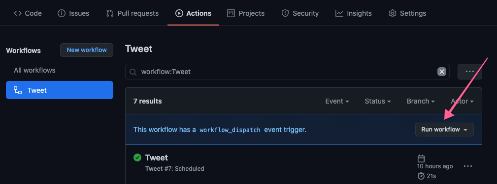

# Game Genre a Day

Tweet a strange and whimsical genre idea per day

This is a twitter bot which generates and tweets a new video game genre every day for the purposes of sparking intelligent and interesting conversations and building up a community around discussions of video game genres.

This bot runs entirely within Github Actions!

You can use this repo as an example of setting up a twitter bot on a schedule.

All you need:

* A twitter account
* An idea

## How it works

* [Here's](./generator.ts) where we generate a game genre.
* [Here's](./run.ts) a script which tweets a single genre.
* [Here's](./.github/workflows/tweet.yml) the Github Actions workflow which automatically tweets once a day.

To get set up with your own bot:

1. Fork or copy this repo
2. Update the `generate()` function in [`./generator.ts`](./generator.ts) to generate any kind of tweet you like.
3. [Create a developer account](https://developer.twitter.com/en/portal/dashboard) for which ever twitter account you want to interact with.
4. Create a project in your developer account. Collect your API Key and Secret
5. Generate an Access token & Secret for your project.
6. Set your `API_KEY`, `API_SECRET`, `ACCESS_TOKEN_KEY`, and `ACCESS_TOKEN_SECRET` as environment variables in the **Secrets** tab of your repo settings so they are accessible to the [main script](./run.ts)
7. Update the "schedule" frequency to tweet as often as you like! [This site](https://crontab.guru/) is helpful for picking your CRON frequency.
8. You can test out your workflow on its "Actions" page using a manual trigger.

